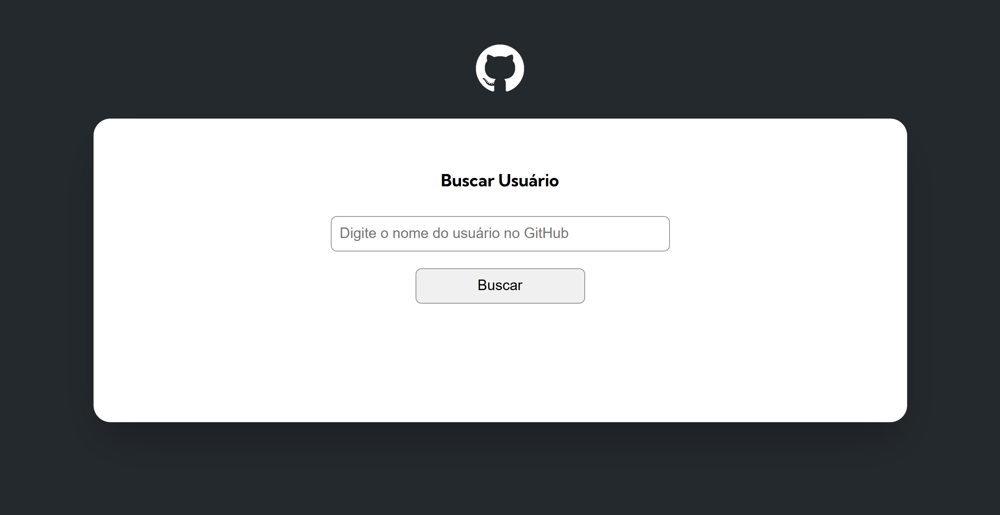
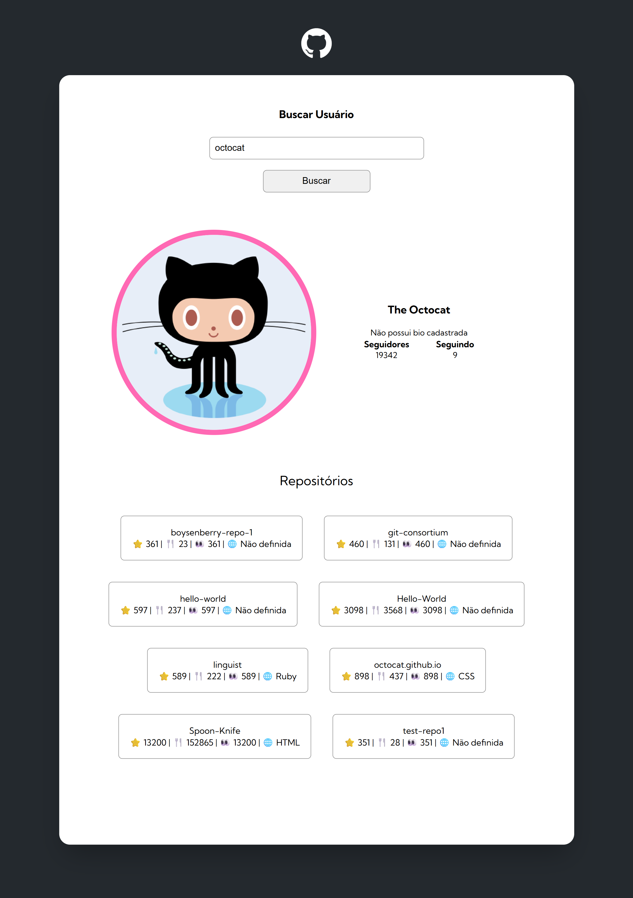

# Quest JS avançado - Projeto inicial fetch github api main

Esta é uma solução para a Quest de JS Avançado.

## Índice

- [Visão geral](#Visão-geral)
  - [O desafio](#o-desafio)
  - [Screenshots](#Screenshost)
- [Meu processo](#meu-processo)
  - [Construído com](#construido-com)
  - [O que aprendi](#o-que-aprendi)
  - [Desenvolvimento contínuo](#desenvolvimento-contínuo)
- [Autor](#autor)

## Visão geral

### O desafio

- Adaptar o projeto construido durante as aulas as novas exigencias.

### Screenshots

### Links
Live Site URL: 

## Meu processo

### Construído com

- Semantic HTML5 markup
- CSS custom properties
- Js avançado

### O que aprendi

Eu consolidei meus conhecimentos em JS, principalmente em como trabalhar com APIs.

### Desenvolvimento contínuo

Planejo continuar focando em consolidar minhas habilidades em JS e, em breve, começar a ver react.

## Autor

- Frontend Mentor - [@Isabela-Fernanda](https://www.frontendmentor.io/profile/Isabela-Fernanda)
- Gmail - [arty.7f@gmail.com](arty.7f@gmail.com)

